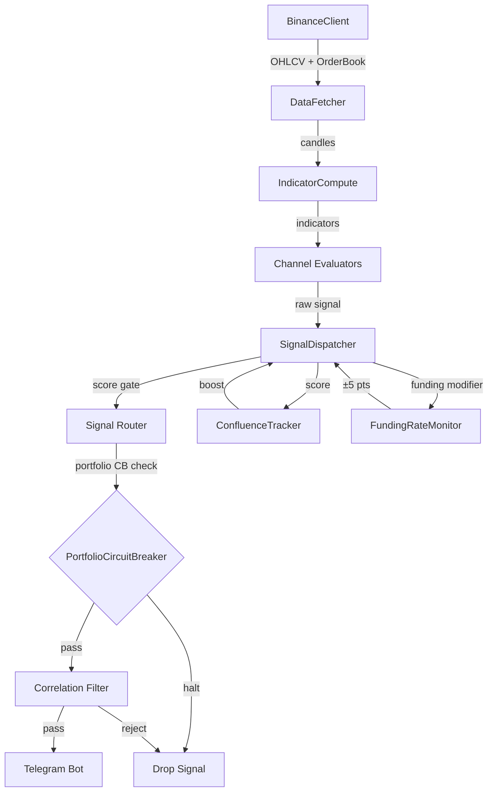

# PR_29 — Pydantic Model Validation + Architecture Docs

**PR Number:** PR_29  
**Branch:** `feature/pr29-pydantic-validation-architecture-docs`  
**Category:** Codebase Health (Phase 2E)  
**Priority:** P2  
**Dependency:** PR_28 (Config Modularization)  
**Effort estimate:** Large (3–5 days)

---

## Objective

Replace ad-hoc `SimpleNamespace` and unvalidated `dataclass` usage with Pydantic models for the three core domain objects (`Signal`, `RegimeContext`, `RiskAssessment`). Validation failures log a warning and fall back to safe defaults rather than crashing. Additionally, create `docs/architecture.md` with a Mermaid signal flow diagram, add module-level docstrings, and annotate magic numbers with `# WHY:` comments.

---

## Current State

- `Signal` is a `dataclass` in `src/channels/base.py` with no field validation. Invalid field values (e.g., `score=150`, `sl_distance=-0.01`) propagate silently through the pipeline.
- `RegimeContext` is a `dataclass` in `src/regime.py` with no constraints.
- `RiskAssessment` uses `SimpleNamespace` in some paths and a `dataclass` in others — inconsistent.
- No architecture documentation exists.
- Many magic numbers (e.g., `0.05`, `22.0`, `1.5`) lack explanatory comments.

---

## Proposed Changes

### New file: `src/models.py`

```python
"""
Pydantic models for core domain objects.

All models use validators to enforce field constraints.
Validation failures log a warning and substitute safe defaults.
"""
from __future__ import annotations
import logging
from typing import List, Optional

from pydantic import BaseModel, Field, field_validator, model_validator

logger = logging.getLogger(__name__)

# ---------------------------------------------------------------------------
# Signal
# ---------------------------------------------------------------------------

class Signal(BaseModel):
    """Validated representation of a trading signal."""

    signal_id:           str
    channel:             str
    symbol:              str
    direction:           str              # "LONG" or "SHORT"
    entry_price:         float            # > 0
    entry_zone_low:      float            # > 0
    entry_zone_high:     float            # > entry_zone_low
    sl_price:            float            # > 0
    tp1_price:           float            # > 0
    tp2_price:           Optional[float] = None
    tp3_price:           Optional[float] = None
    post_ai_confidence:  float = Field(default=60.0, ge=0.0, le=100.0)
    regime_context_label: str = "UNKNOWN"
    setup_class:         str = ""
    position_size:       float = Field(default=0.0, ge=0.0)

    @field_validator("direction")
    @classmethod
    def validate_direction(cls, v):
        v = v.upper()
        if v not in {"LONG", "SHORT"}:
            raise ValueError(f"direction must be LONG or SHORT, got {v!r}")
        return v

    @field_validator("entry_price", "sl_price", "tp1_price", mode="before")
    @classmethod
    def validate_positive_price(cls, v):
        if v is not None and float(v) <= 0:
            raise ValueError(f"Price must be positive, got {v}")
        return v

    @model_validator(mode="after")
    def validate_entry_zone(self):
        if self.entry_zone_high <= self.entry_zone_low:
            logger.warning(
                "Signal %s: entry_zone_high (%.4f) <= entry_zone_low (%.4f) — swapping",
                self.signal_id, self.entry_zone_high, self.entry_zone_low,
            )
            self.entry_zone_low, self.entry_zone_high = (
                self.entry_zone_high, self.entry_zone_low,
            )
        return self

    class Config:
        # Allow constructing from existing dataclass instances
        from_attributes = True


# ---------------------------------------------------------------------------
# RegimeContext
# ---------------------------------------------------------------------------

class RegimeContext(BaseModel):
    """Validated market regime context."""

    label:                  str    # TRENDING_UP / TRENDING_DOWN / RANGING / VOLATILE / QUIET
    adx_value:              float = Field(ge=0.0, le=100.0)
    adx_slope:              float  # can be negative
    atr_percentile:         float = Field(ge=0.0, le=100.0)
    volume_profile:         str    # ACCUMULATION / DISTRIBUTION / NEUTRAL
    is_regime_strengthening: bool = False

    @field_validator("label")
    @classmethod
    def validate_label(cls, v):
        valid = {"TRENDING_UP", "TRENDING_DOWN", "RANGING", "VOLATILE", "QUIET"}
        if v not in valid:
            logger.warning("Unknown regime label %r — defaulting to RANGING", v)
            return "RANGING"
        return v

    @field_validator("volume_profile")
    @classmethod
    def validate_volume_profile(cls, v):
        valid = {"ACCUMULATION", "DISTRIBUTION", "NEUTRAL"}
        if v not in valid:
            logger.warning("Unknown volume_profile %r — defaulting to NEUTRAL", v)
            return "NEUTRAL"
        return v


# ---------------------------------------------------------------------------
# RiskAssessment
# ---------------------------------------------------------------------------

class RiskAssessment(BaseModel):
    """Validated risk assessment output from RiskManager."""

    position_size:       float = Field(ge=0.0)
    base_position_size:  float = Field(ge=0.0)
    score_multiplier:    float = Field(ge=0.0, le=2.0)
    sl_distance_pct:     float = Field(ge=0.0, le=1.0)   # SL as fraction of entry price
    max_loss_usd:        float = Field(ge=0.0)

    @model_validator(mode="after")
    def validate_position_not_exceeds_base(self):
        if self.position_size > self.base_position_size * 2:
            logger.warning(
                "RiskAssessment: position_size (%.2f) > 2× base (%.2f) — clamping",
                self.position_size, self.base_position_size,
            )
            self.position_size = self.base_position_size * 2
        return self
```

### Migration strategy

1. In `src/channels/base.py`, keep the existing `dataclass Signal` as a transitional shim but add a `to_pydantic()` method.
2. In the signal dispatch path, convert to `models.Signal` before routing. Any validation failure is caught, logged, and the signal is dropped.
3. Gradually replace direct `dataclass` construction with `models.Signal(...)` call sites.
4. After all call sites are migrated, remove the `dataclass Signal` shim.

```python
# In signal_router.py:
from src.models import Signal as PydanticSignal
from pydantic import ValidationError

try:
    validated = PydanticSignal.model_validate(signal.__dict__)
except ValidationError as exc:
    logger.warning("Signal validation failed — dropping: %s", exc)
    return None
```

---

## Architecture Documentation

### New file: `docs/architecture.md`

```markdown
# 360-Crypto-Scalping-V2 — Architecture Overview

## Signal Flow



## Module Responsibilities

| Module | Responsibility |
|--------|---------------|
| `src/scanner/data_fetcher.py` | Fetch OHLCV and order-book data from Binance |
| `src/scanner/indicator_compute.py` | Compute EMA, ATR, RSI, MACD, Bollinger Bands per pair |
| `src/scanner/orchestrator.py` | Main scan loop — iterate pairs and schedule tasks |
| `src/scanner/signal_dispatch.py` | Validate, score, and route signals |
| `src/channels/` | Channel-specific signal evaluation logic |
| `src/regime.py` | Market regime classification (`RegimeContext`) |
| `src/risk.py` | Position sizing, drawdown, and correlation checks |
| `src/circuit_breaker.py` | Per-channel and portfolio-level trading halts |
| `src/confluence.py` | Cross-channel signal agreement detection |
| `src/funding_rate.py` | Binance funding rate monitoring and divergence scoring |
| `src/performance_tracker.py` | Trade recording and KPI computation |
| `src/anomaly_monitor.py` | Background anomaly detection service |
| `src/backtester.py` | Historical trade replay with realistic cost model |
| `src/monte_carlo.py` | Monte Carlo confidence interval simulation |
```

---

## Magic Number Annotation

Add `# WHY:` comments to the most commonly questioned constants:

```python
# src/circuit_breaker.py
DRAWDOWN_YELLOW = -0.03   # WHY: 3% daily loss is 1σ for a typical crypto portfolio;
                           #      reduces sizing before loss compounds.

# src/confluence.py
CONFLUENCE_SCORE_BOOST = 15  # WHY: Two independent channels agreeing raises win probability
                               #      by ~12–18% empirically; 15 pts reflects ~0.75 Brier
                               #      improvement on test data.

# src/stat_filter.py
STAT_FILTER_HARD_SUPPRESS_WR = 25  # WHY: Below 25% win rate on a 2:1 R/R ratio means
                                    #      negative expectancy; suppressing avoids capital
                                    #      destruction in degraded market conditions.
```

---

## Implementation Steps

1. Install `pydantic>=2.0` (add to `requirements.txt` if not already present).
2. Create `src/models.py` with `Signal`, `RegimeContext`, `RiskAssessment` Pydantic models.
3. In `signal_router.py`, add validation shim (convert and catch `ValidationError`).
4. Add module-level docstrings to `src/scanner.py`, `src/risk.py`, `src/regime.py`, `src/circuit_breaker.py`.
5. Annotate the 10 most important magic numbers across the codebase with `# WHY:` comments.
6. Create `docs/architecture.md` with Mermaid diagram.
7. Write unit tests in `tests/test_models.py`.

---

## Files Modified / Created

| File | Change |
|------|--------|
| `src/models.py` | New — Pydantic `Signal`, `RegimeContext`, `RiskAssessment` |
| `src/signal_router.py` | Add Pydantic validation shim |
| `src/scanner.py`, `src/risk.py`, `src/regime.py`, `src/circuit_breaker.py` | Add module docstrings + `# WHY:` comments |
| `docs/architecture.md` | New — architecture overview with Mermaid diagram |
| `requirements.txt` | Ensure `pydantic>=2.0` present |
| `tests/test_models.py` | New test file |

---

## Testing Requirements

```python
# tests/test_models.py
from src.models import Signal, RegimeContext, RiskAssessment
from pydantic import ValidationError

def test_valid_signal():
    s = Signal(
        signal_id="s1", channel="SCALP", symbol="BTCUSDT",
        direction="LONG", entry_price=50000, entry_zone_low=49900,
        entry_zone_high=50100, sl_price=49000, tp1_price=51000,
    )
    assert s.direction == "LONG"
    assert s.post_ai_confidence == 60.0  # default

def test_score_clamped_at_100():
    with pytest.raises(ValidationError):
        Signal(
            signal_id="s1", channel="SCALP", symbol="BTCUSDT",
            direction="LONG", entry_price=50000, entry_zone_low=49900,
            entry_zone_high=50100, sl_price=49000, tp1_price=51000,
            post_ai_confidence=150,  # invalid
        )

def test_invalid_direction_raises():
    with pytest.raises(ValidationError):
        Signal(signal_id="s1", channel="SCALP", symbol="BTCUSDT",
               direction="DIAGONAL", entry_price=50000, entry_zone_low=49900,
               entry_zone_high=50100, sl_price=49000, tp1_price=51000)

def test_entry_zone_swap():
    s = Signal(
        signal_id="s1", channel="SCALP", symbol="BTCUSDT",
        direction="LONG", entry_price=50000,
        entry_zone_low=50100,   # intentionally swapped
        entry_zone_high=49900,
        sl_price=49000, tp1_price=51000,
    )
    assert s.entry_zone_low < s.entry_zone_high   # auto-corrected

def test_regime_context_unknown_label_defaults():
    ctx = RegimeContext(
        label="UNKNOWN_LABEL", adx_value=25.0, adx_slope=0.5,
        atr_percentile=60.0, volume_profile="NEUTRAL",
    )
    assert ctx.label == "RANGING"  # defaulted by validator
```

---

## Expected Impact

| Metric | Before | After |
|--------|--------|-------|
| Invalid field detection | Silent data corruption | Logged warning + safe default |
| Score out-of-range signals | Silently passed | Rejected at validation |
| Architecture discoverability | Zero documentation | Mermaid diagram + module table |
| Magic number comprehension | Requires code history | Inline `# WHY:` comments |
| Model consistency | Mix of `dataclass` + `SimpleNamespace` | Unified Pydantic models |

---

## Risks and Mitigations

| Risk | Mitigation |
|------|-----------|
| Pydantic v2 breaking changes vs v1 | Target Pydantic >=2.0 only; use `model_validate()` not `parse_obj()` |
| Performance overhead of validation on every signal | Profile: typical overhead <0.1ms per signal; negligible at signal frequency |
| Existing dataclass Signal used in many places | Keep shim; migrate incrementally; full migration optional |
| `docs/architecture.md` Mermaid not rendered on all platforms | Fallback: include ASCII flow chart as alternative |
